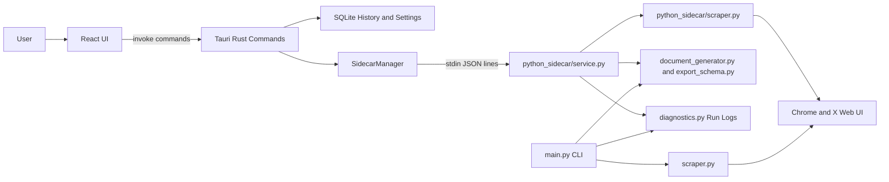

# X/Twitter Scraper Project Context

## Purpose
This repository is a Python/Selenium scraper and Tauri desktop app for personal X/Twitter archiving. The intended publishable product should help a non-technical user collect posts they are authorized to view, save the results locally, and understand the limits of browser automation.

This document reflects the current codebase. It does not assume a workflow is production-ready unless code, tests, or release configuration support that claim.

## Repository Map

| Area | Files | Current role |
| --- | --- | --- |
| Python CLI | `main.py`, `scraper.py`, `config.py` | Interactive Turkish CLI for manual or username/password login, profile/bookmark scraping, count/days/date-range modes, selector diagnostics, and export saving. |
| Shared Python export layer | `document_generator.py`, `export_schema.py` | JSON, Markdown, and DOCX writers; schema version `0.2`; safe filename/path helpers; atomic writes. |
| Diagnostics and run logs | `diagnostics.py`, `config.py` | Structured run log schema `0.3`, failure reason codes, selector diagnostics based on `CORE_SELECTOR_CHECKS`, and log saving under `output/<target>/logs/`. |
| Python sidecar | `python_sidecar/service.py`, `python_sidecar/scraper.py`, `python_sidecar/session_manager.py`, `python_sidecar/analytics.py`, `python_sidecar/ai_analyzer.py`, `python_sidecar/models.py` | JSON-lines stdio service used by Tauri; sidecar-specific Selenium scraper with events, pause/resume/cancel, cookie restore, metrics, export, diagnostics, analytics, and optional OpenAI analysis. |
| Tauri/Rust shell | `src-tauri/src/lib.rs`, `src-tauri/src/sidecar/mod.rs`, `src-tauri/src/commands/*.rs`, `src-tauri/src/db/mod.rs` | Desktop process, tray, SQLite persistence, command bridge, sidecar process management, export file writers, settings, history, and placeholder license handling. |
| React app | `src/App.tsx`, `src/components/**`, `src/hooks/**`, `src/stores/**`, `src/locales/*.json` | Dashboard, scrape configuration, progress/log view, results/export UX, history, analytics, AI, settings, onboarding, Zustand state stores, Tauri event listeners, and i18n. |
| Tests | `tests/test_exports.py`, `tests/test_diagnostics.py` | Browser-free unit tests for export schema/path helpers, file writers, diagnostics serialization, selector checks with fake driver, and run log saving. |
| Build/release config | `package.json`, `vite.config.ts`, `tsconfig.json`, `src-tauri/Cargo.toml`, `src-tauri/tauri.conf.json`, `src-tauri/capabilities/default.json`, `src-tauri/.cargo/config.toml`, `requirements.txt`, `python_sidecar/requirements.txt` | Frontend build, Tauri v2 build, Rust dependencies, app metadata, capabilities, Python dependencies, and sidecar dependencies. |
| Documentation | `README.md` | Good technical overview for CLI and dev usage, but incomplete for final desktop packaging, support, privacy, and release operations. |

## Current Architecture

## What Already Works

- The Python CLI has a complete interactive flow for profile or bookmark scraping, export format choice, partial result saving on interrupt/error, and selector diagnostics.
- The shared export layer has browser-free tests and uses a versioned JSON schema, path sanitization, and atomic writes.
- The diagnostics layer has structured run logs with schema versioning, reason codes, and tests for serialization and selector diagnostics.
- The desktop app has a real Tauri/React shell with routes for dashboard, scrape configuration, progress, results, history, analytics, AI, settings, and onboarding.
- The sidecar can communicate with Tauri through JSON lines and emits progress, complete, tweet update, login, export, log, and diagnostics events.
- SQLite persistence exists for settings, scrape history, and tweets.
- The UI includes a non-technical flow for opening Chrome, waiting for login, configuring scrapes, watching progress, and exporting results.

## Partially Implemented

- Desktop packaging is configured at a Tauri level, but the Python sidecar, root Python helper modules, and Python dependencies are not clearly bundled as installer resources.
- `src-tauri/src/sidecar/mod.rs` starts a system `python`, `python3`, or `py` process and searches for `python_sidecar/service.py`; this is suitable for dev but not final-user install.
- `python_sidecar/models.py` defines Pydantic command/response models, but `python_sidecar/service.py` mostly uses raw dictionaries.
- `src-tauri/src/db/mod.rs` defines a `schedules` table, and UI/license copy mentions scheduled scraping, but there is no exposed scheduling workflow.
- License handling in `src-tauri/src/commands/license.rs` is prefix-based placeholder logic, while frontend copy implies real tiers.
- AI analysis is present, but it depends on user-provided OpenAI API keys and sidecar dependencies that are not in the root `requirements.txt`.
- The React `useScraper.ts` hook duplicates parts of `scrapeStore.ts` and appears unused, making future reintroduction risky.
- History export through `export_results` depends on sidecar `current_tweets`; older SQLite-only scrapes are not clearly reloaded into the sidecar before export.

## Fragile Areas

- X/Twitter DOM selectors, text labels, login flows, article pages, and timeline behavior can change without notice.
- Login success detection is heuristic. Some paths continue after ambiguous login checks.
- Long tweet and article extraction rely on opening new tabs/pages and filtering page text heuristically.
- Scrolling uses repeated DOM checks and time-based waits. Empty timelines, rate limits, interstitials, blocked accounts, private accounts, and login walls can look similar.
- Engagement metric extraction is sidecar-specific and not covered by tests.
- Date handling differs across Python objects, JSON strings, React numeric expectations, and SQLite storage.
- Settings are mirrored between SQLite and `localStorage`, which can diverge.

## Duplicated or Divergent Logic

- There are two Selenium scraper implementations: `scraper.py` for CLI and `python_sidecar/scraper.py` for desktop.
- Export generation exists in Python (`document_generator.py`) and in React/Rust result export paths (`src/components/scrape/ScrapeResults.tsx`, `src-tauri/src/commands/export.rs`).
- Scrape state is handled in `src/stores/scrapeStore.ts` and partly duplicated in `src/hooks/useScraper.ts`.
- License/export feature claims are split between `src/hooks/useLicense.ts`, `src/components/settings/SettingsPanel.tsx`, and Rust placeholder validation.

## Risky for Final Users

- A packaged desktop app may fail to start scraping if Python, dependencies, Chrome, ChromeDriver, or the sidecar file layout are missing.
- Saved X cookies are local JSON files in the sidecar session directory. They need explicit privacy documentation and stronger storage decisions before public release.
- Tauri CSP is disabled in `src-tauri/tauri.conf.json`, and capabilities include broad shell permissions in `src-tauri/capabilities/default.json`.
- The app handles personal scraped data, local exports, optional API keys, and browser sessions. The current README does not fully explain where data is stored and how to delete it.
- Placeholder paid-tier/license copy could mislead users and reviewers.
- Public release would create a support burden around X rate limits, account restrictions, login changes, and DOM breakage.

## Blocking Public Release

1. A clean Windows install cannot be trusted until the Python sidecar and dependencies are bundled or first-run checks clearly guide the user.
2. The dual scraper implementations should be unified or a clear owner/test strategy should exist.
3. Export schema and export generation need one source of truth across CLI, sidecar, and desktop UI.
4. Privacy/security posture needs review: cookie storage, local data storage, OpenAI key handling, CSP, and Tauri capabilities.
5. Product claims need to match shipped behavior. Remove or gate unimplemented licensing, scheduling, CSV/Excel, and advanced claims.
6. Release tests are insufficient: there are no frontend tests, Rust tests, sidecar protocol tests, CI, installer smoke tests, or Selenium manual regression scripts.

## Product Definition

### Target User
- Personal archivists, researchers, creators, journalists, and power users who want local copies of X/Twitter posts or bookmarks they are authorized to access.
- Users should be comfortable with platform limitations and understand that scraping the web UI is best-effort.

### Core Use Cases
- Log into X in a visible Chrome window.
- Scrape public profile posts by count, last N days, or date range.
- Scrape the signed-in user's bookmarks.
- Save results locally as JSON, Markdown, or DOCX.
- Review progress, errors, logs, and partial results.
- Reopen history and inspect previous local runs.

### What The App Should Promise
- Local-first archiving of accessible X/Twitter content.
- Best-effort extraction with transparent logs and clear failure reasons.
- Stable, documented export schemas for downstream use.
- No credential collection by the app beyond local browser/session automation.
- User-controlled output directories and deletion guidance.

### What The App Should Not Promise
- No guarantee of completeness, real-time accuracy, or stable selector behavior.
- No bypassing private content, paywalls, blocked accounts, platform restrictions, CAPTCHAs, rate limits, or anti-automation systems.
- No guarantee that using the tool is allowed under every user's account, region, organization policy, or X's current terms.
- No cloud sync, monitoring, or account-growth analytics unless explicitly implemented and documented.
- No paid/pro features until real licensing, support, and feature gates exist.

### Ethical and Legal Boundaries
- Use only for content the user owns or is authorized to access.
- Do not use for harassment, surveillance, credential theft, spam, ban evasion, scraping private content, or redistribution that violates rights or platform terms.
- Respect account safety and platform rate limits. Stop on warnings, interstitials, suspicious-login prompts, or degraded account state.
- Disclose that the app automates the X web UI and may violate platform terms depending on usage.

### Required Disclaimers
- X/Twitter is a trademarked third-party platform. The project is not affiliated with, endorsed by, or sponsored by X Corp.
- The scraper is best-effort and may break when X changes its UI.
- Users are responsible for complying with applicable laws, platform terms, and content rights.
- The app stores local data, exports, logs, and potentially browser session cookies. Users should understand where and how to delete them.
- AI analysis, if enabled, may send tweet text to OpenAI using the user's API key.

### Expected Export Workflow
1. User logs in through Chrome or restores a saved local session.
2. User selects profile or bookmarks, mode, limits, and output settings.
3. App shows progress, warnings, selector diagnostics, and partial recovery options.
4. User reviews results before export.
5. User exports JSON by default, with optional Markdown/DOCX once schema parity is guaranteed.
6. App records export path, schema version, run log path, warnings, and failure reason if incomplete.

### Expected Desktop UX
- First-run onboarding explains Chrome/Python or bundled runtime requirements, platform limits, privacy, and where data is stored.
- Settings include Chrome path, output directory, session management, data deletion, language, and diagnostics.
- Progress screen shows counts, current stage, logs, pause/resume/cancel, and clear next actions.
- Results/history screens distinguish completed, partial, failed, cancelled, and empty runs.
- Errors are written for non-technical users first, with technical details available in diagnostics.

## Missing or Weak Documentation

- No `CONTRIBUTING.md`, `SECURITY.md`, privacy/data handling note, support policy, issue templates, or release checklist.
- README does not fully explain final desktop packaging, Python sidecar layout, Windows install prerequisites, cookie storage, app data paths, or troubleshooting.
- No architecture diagram or sidecar protocol reference.
- No export schema reference beyond the README example.
- No documented manual QA matrix for login, bookmarks, long tweets, articles, empty states, cancellation, partial recovery, exports, or installer testing.
- No changelog or versioning policy across `package.json`, `src-tauri/Cargo.toml`, `src-tauri/tauri.conf.json`, UI copy, and export schema.
